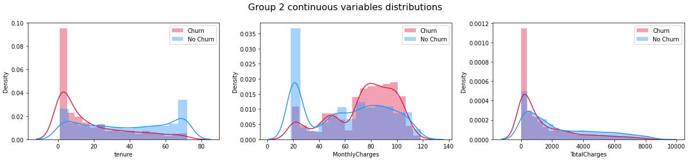
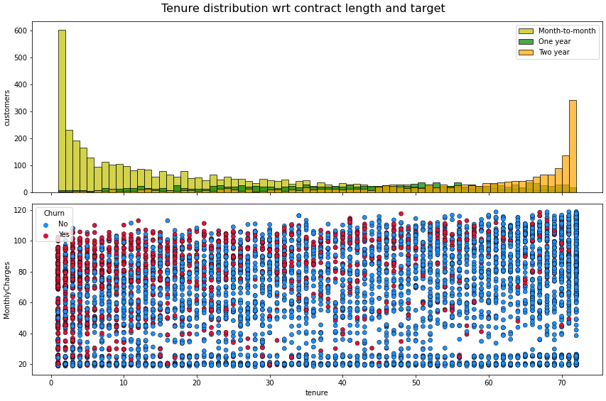

## Customer Churn Prediction 

### Project Overview
* Created a XGBoost Classification Model to predict a telecommunication company customers decision to stay or leave, predicting 81% of the churn cases.
* Analyzed customers information dividing it different groups.
* Plotted and analyzed evaluation metrics curves and feature importances.

### Code and Resources Used 
**Python Version:** 3.7  
**Packages:** pandas, numpy, matplotlib, seaborn, sklearn.

### Dataset
The dataset is taken from Leaps Analyttica (www.leaps.analyttica.com/) and contains services, account and demographic information of 10000 customers of a telecommunication company represented in 21 features. Data is highly unbalanced with respect to the target.  
Dataset: https://www.kaggle.com/datasets/blastchar/telco-customer-churn 

### EDA
* Features grouping and distribution analysis.
* Continuous variables analysis against different groups.
* Correlation analysis

Below are notebook captures as examples of our analysis:  

  
  

### Data preparation
Categorical data was encoded into dummy variables and splited in train (80%) and test (20%) sets.

### Models Building and Performance
An XGBoost Model was tuned with GridSeachCV obtaining:

* **XGBoost**: precision=0.41, recall=0.81, f1-score=0.61.

### Metrics Chosen 
**Precision, Recall, F1-score.** 

All 3 metrics from the classification report were used for results clear interpretaion and confusion matrix results were printed.

